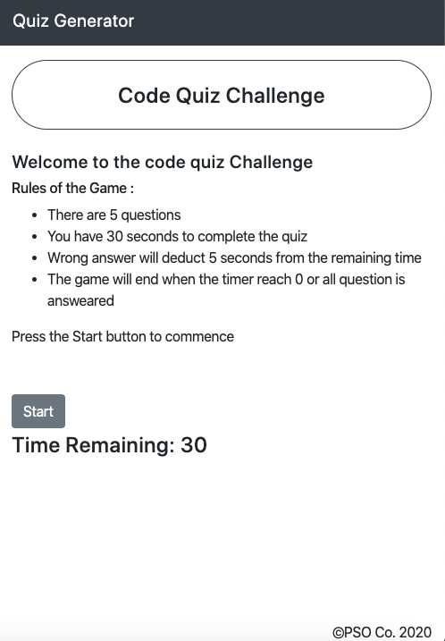

<h1>Quiz Generator</h1>

<h4>Coding Quiz Challenge</h4>

<ul>
<li>Click the Start button to start the quiz</li>
<li>Timer will commence from 30 seconds</li>
<li>Questions and answer options will change when an answer is selected</li>
<li>Correct answer will +1 to score and return 'Correct' in feedback</li>
<li>Wrong answer will -5 seconds from the timer and return 'Wrong' in feedback</li>
<li>The quiz will end when all questions is answered or timer reaches 0</li>
<li>User input name and score is stored in local storage</li>
<li>Top 5 player and score is displayed</li>
<li>User can choose to remove raking from local storage</li>
<li>User can re-try the quiz by clicking Start button</li>
</ul>
